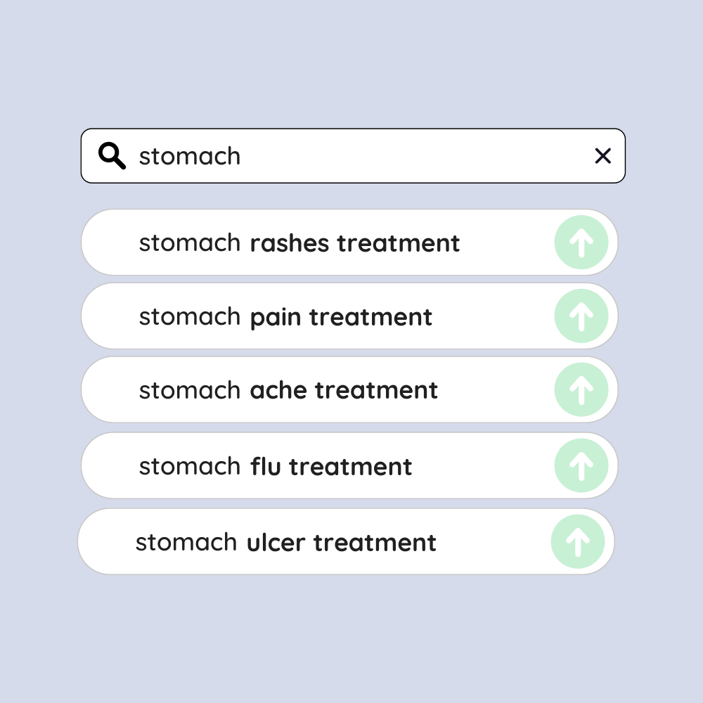
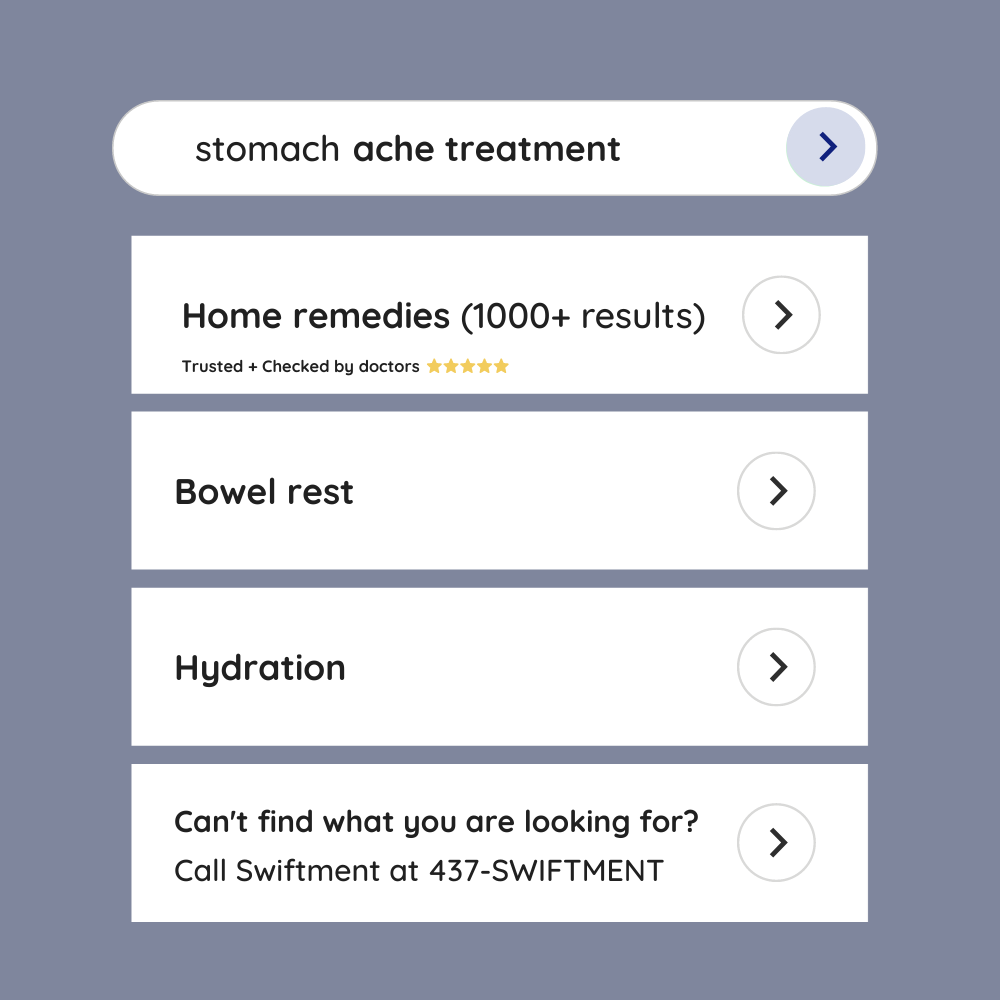

# Swiftment
PoweringSTEMHacks - Hackathon
https://app-medical-innovation.anjalip44.repl.co/

## HTML Code
<!DOCTYPE html>
<html>

<head>
  <meta charset="utf-8">
  <meta name="viewport" content="width=device-width">
  <title>Medical Innovation</title>
  <link href="style.css" rel="stylesheet" type="text/css" />
  
	<!-- Link the webpage's stylesheet -->
	<link rel="stylesheet" href="/style.css" />

	<!-- Link the webpage's JavaScript file -->
	

  <!-- Link to favicon -->
  <link rel="icon" type = "image/png" href="assets/sm.png">

  <meta name="viewport" content="width=device-width, initial-scale=1.0">
  
  <!-- Link to fonts -->
  <link rel="preconnect" href="https://fonts.googleapis.com"><link rel="preconnect" href="https://fonts.gstatic.com" crossorigin><link href="https://fonts.googleapis.com/css2?family=Maven+Pro:wght@600&display=swap" rel="stylesheet"> 
  
</head>

<body>
  

  

  <ul>
    <li class="install"><a href="#top">Install</a></li>
    <li><a href="#features">Features</a></li>
    <li><a href="#product">Product</a></li>

  

  

  
  <button class="download">Download on IOS </button>
  <button class="download">Download on Android </button>
  

  

  

  

  

  

<!-- Slideshow container -->
 

  

    
1 / 3

    
  

  

    
2 / 3

    
  

  

    
3 / 3

    
  

  <a class="prev" onclick="plusSlides(-1)">&#10094;</a>
  <a class="next" onclick="plusSlides(1)">&#10095;</a>

 

  
  
  

 
 

<!-- Features -->
<h1 id="features">Features</h1>

Features from our app that you will love!

  

    

      
    

    

      <h3>Get  fast and reliable treatment for many health concerns by even just typing one word at your fingertips</h3>
    

  

  

    

      <h3>Find various sources and treatment options that are reliable and trusted by many doctors</h3>
    

    

      
    

  

  

    

      
    

    

      <h3>Consult with safe and reliable medical practitioners, free of charge!</h3>
    

  

<footer>
	

	

		

			

			

			
Shop and Learn

				
Store

		    
More Products

    		
Swiftment Features

		    
Swiftment Features on IOS

				
Swiftment Features on Android

		    
More Features on iPhone

		    
More Features on Samsung

				
Product on App Store

  		  
Product on Google play Store

				
More resources

				
Accessories

				
Gift Cards

			

	    

			

				

					
Services

		      
Swiftment treatment

					
Swiftment TV

					
Swift Fitness+

					
Swift News

					
Swift TedTalk

					
Swiftment design

					
Swiftment Credit

					
Swfitment Card

					
Swiftment Podcasts

					
Google Play Store

					
App Store

				

				

				  
Account

					
Swiftment Account

					
Manage your Swiftment Account

					
Swiftment.com

				

			

			

				

					
Swiftment pay Features

					
Find a Store and go buy

					
Smart features

					
Swiftment policy

					
Swiftment Camp

					
Swift Store App

					
Refurbished and Clearance

					
Financing

					
Swiftment Trade In

					
App Status

					
App Help

				

			

			

				

					
For Business

					
Swiftment and Business

					
Shop for Business

				

				

					
For Education
	
					
Swiftmnt and Education

					
Shop for K-12

					
Shop for College

				

				

					
For Healthcare

					
Swiftment in Healthcare

					
Health on App store

					
Health Records on Google Play store

				

				

					
For Government

					
Shop for Government

					
Shop for Veterans Military

				

			

			

				

					
Swiftment Values

					
Accessibility

					
Education

					
Environment

					
Inclusion and Diversity

					
Racial Equity and Justice

					
Supplier Responsibility

				

				

					
About Swiftment

					
Newsroom

					
Swift Leadership

					
Career Opportunities

					
Investors

					
Ethics & Compliance

					
Events

					
Contact Swiftment

				  

				

		

	

	

		
More ways to install: Find on an App store or Google play store or other shop near you. Or call 437-SWIFTMENT.

			

			

			

			
Copyright &copy 2022 Swiftment Inc. All rights reserved.

			

			
Privacy Policy

			

			
Terms of Use

			

			
Sales and Refunds

			

			
Legal

			

			
Site Map

			

		

		
Canada

	

	

	

</footer>

</body>
</html>

## CSS Code
* {
  margin: 0px;
  padding: 0px;
}
body {
  scroll-behavior: smooth;
  background-color: #cedefd;
}

/* Install */
.container {
  display: flex;
  flex-flow: row no-wrap;
  justify-content: space-evenly;
  align-items: center;
  width: 100%;
  height: 700px;
}
.images {
  display: flex;
  flex-direction: row;
  justify-content: space-evenly;
  align-items: center;
}
.imagesclass {
  max-width: 30%;
  overflow: hidden;
  display: flex;
  justify-content: center;
  flex-direction: row;
  align-items: center;
}
.imagesclass img{
  max-width: 200%;
  display: inline-block;  
}
#img1, #img2, #img3 {
  margin: 20px 10px;
}
#smpng {
  border-radius: 12px;
  margin: 10px 30px;
}
.title {
  display: flex;
  justify-content: center;
  flex-direction: column;
}
.download {
  background-color: black;
  color: white;
  border: none;
  border-radius: 12px;
  padding: 10px;
  margin: 4px 4px;
  text-align: center;
  vertical-align: middle;
  font-family: 'Maven Pro', sans-serif;
}
.download:hover {
  font-family: 'Maven Pro', sans-serif;
  background-color: white;  
  color: black;
}

/* Nav Bar */
.navbar {
  position: sticky;
  top: 0;
  right: 0;
  left: 0;
  overflow: hidden;
	padding-top: .5em;
	padding-bottom: .5em;
	border: 1px solid #a2a2a2;
	background-color: #f4f4f4;
	-webkit-box-shadow: 0px 0px 14px 0px rgba(0,0,0,0.75);
	-moz-box-shadow: 0px 0px 14px 0px rgba(0,0,0,0.75);
	box-shadow: 0px 0px 14px 0px rgba(0,0,0,0.75);
	-webkit-border-radius: 5px;
	-moz-border-radius: 5px;
	border-radius: 5px;
	align-items: center;
  max-width: 100%;
}
ul {
  list-style-type: none;
  margin: 0;
  padding: 0;
  overflow: hidden;
  top: 0;
}
li {
  float: right;
}
li a {
  font-family: 'Maven Pro', sans-serif;
  display: block;
  color: black;
  text-align: center;
  padding: 16px;
  font-size: 15px;
  text-decoration: none;
}
a {
	color: #34495e;
	font-size: 1em;
}
a:hover {
	color: #718daa;
}
.logo {
  position: fixed;
  padding: 0px 10px;
}
.install {
  margin-right: 5px;
  border-radius: 20px;
  background-color: #86b4fd;
}
.install:hover {
  background-color: #cddef9;
  color: white;
}

/* Product */
* {box-sizing:border-box}
.slideshow-container {
  justify-content: center;
  max-width: 85%;
  position: relative;
  margin: auto;
	background-color: #f4f4f4;
	-webkit-box-shadow: 0px 0px 14px 0px rgba(0,0,0,0.75);
	-moz-box-shadow: 0px 0px 14px 0px rgba(0,0,0,0.75);
	box-shadow: 0px 0px 14px 0px rgba(0,0,0,0.75);
	-webkit-border-radius: 5px;
	-moz-border-radius: 5px;
	border-radius: 5px;
	align-items: center;
}
.mySlides {
  display: none;
}
.prev, .next {
  cursor: pointer;
  position: absolute;
  top: 45%;
  width: auto;
  margin-top: -22px;
  padding: 16px;
  color: gray;
  font-weight: bold;
  font-size: 18px;
  transition: 0.6s ease;
  border-radius: 0 3px 3px 0;
  user-select: none;
}
.next {
  right: 0;
  border-radius: 3px 0 0 3px;
}
.prev:hover, .next:hover {
  color: white;
  background-color: darkblue;
}
.numbertext {
  color: #f2f2f2;
  font-size: 12px;
  padding: 8px 12px;
  position: absolute;
  top: 0;
}
.dot {
  cursor: pointer;
  height: 15px;
  width: 15px;
  margin: 2px 2px;
  background-color: #bbb;
  border-radius: 50%;
  display: inline-block;
  transition: background-color 0.6s ease;
}
.active, .dot:hover {
  background-color: #717171;
}
.fade {
  animation-name: fade;
  animation-duration: 0.3s;
}
@keyframes fade {
  from {opacity: 0.2}
  to {opacity: 1}
}

/* Features */
#features {
  font-family: 'Maven Pro', sans-serif;
  color: #EBF0FF;
  font-size: 80px;
  padding: 10px;
  text-align: center;
  width: 100%;
  background-color: #10217D;
}
.features {
  text-align: center;
  padding: 20px;
  font-family: 'Maven Pro', sans-serif;
  color: #10217D;
  font-size: 25px;
}
.ftcontainer {
  display: flex;
  flex-direction: column;
  align-items: center;
  align-self: center;
  margin: 0;
  justify-content: center;
}
.feature1, .feature2, .feature3 {
  display: flex;
  padding-top: 3.5em;
  flex-direction: row;
  gap: 10px 30px;
  width: 60%;
  justify-content: space-around;
}
.feature1 {
  padding-top: 2em;
}
.feature3 {
  padding-bottom: 2em;
}
.ftext1, .ftext3 {
  font-family: 'Maven Pro', sans-serif;
  justify-self: flex-start;
  font-size: 40px;
  color: #10217D;
  align-self: center;
}
.ftext2 {
  font-family: 'Maven Pro', sans-serif;
  justify-self: flex-end;
  font-size: 40px;
  color: #10217D;
  align-self: center;
}
.ftimg1, .ftimg2, .ftimg3 {
  align-self: center;
  border: 12px solid #10217D;
}

/* Footer */
footer {
  font-family: 'Maven Pro', sans-serif;
  color: #10217D;
	display: flex;
	flex-direction: column;
	align-items: center;
	justify-content: center;
	padding: 10%;
	gap: 50px;
	background: #b9c9f9;
	padding-bottom: 21px;
	padding-top: 20px;
}
.footer {
	display: flex;
	flex-direction: column;
	gap: 50px;
	justify-content: center;
}

footer .footer-features .footer-feature {
	display: flex;
	flex-direction: column;
	gap: 10px;
	justify-content: center;
	align-items: center;
	width: 33%;
	text-align: center;
}
footer .boring {
	display: flex;
	flex-direction: column;
	width: 100%;
	gap: 34px;
}
footer .boring .links {
	display: flex;
	justify-content: space-between;
	align-items: flex-start;
	width: 100%;
}
footer .boring .links .column {
	display: flex; 
	flex-direction: column;
	gap: 18px;
}
footer .boring .links .column .inner {
	display: flex; 
	flex-direction: column;
	gap: 9px;
}
footer .boring .links .column .inner p:not(.header) {
	font-size: 12px;
	color: #424245;
	cursor: pointer;
	width: fit-content;
}
footer .boring .links .column .inner p:not(.header):hover {
	text-decoration: underline;
}
footer .boring .bottom {
	display: flex;
	gap: 7px;
	flex-direction: column;
	width: 100%;
}
footer .boring .bottom p {
	color: #6E6E73;
	font-size: 12px;
}
footer .boring .bottom p .link-colored {
	color: #0071E3;
}
footer .boring .bottom p .link-colored:hover {
	text-decoration: none;
}
footer .boring .bottom hr {
	height: 1px;
	width: 100%;
	background: #636a8c;
	border: none;
}
footer .boring .bottom .legal {
	display: flex;
	justify-content: space-between;
}
footer .boring .bottom .legal .left {
	display: flex;
	gap: 50px;
}
footer .boring .bottom .legal .left .legal-links {
	display: flex;
	gap: 10px;
}
footer .boring .bottom .legal .left .legal-links p {
	color: #424245;
}
footer .boring .bottom .legal .left .legal-links .seperator {
	width: 1px;
	height: 100%;
	background: #636a8c;
}

## JavaScript Code
let slideIndex = 1;
showSlides(slideIndex);
function plusSlides(n) {
  showSlides(slideIndex += n);
}
function currentSlide(n) {
  showSlides(slideIndex = n);
}
function showSlides(n) {
  let i;
  let slides = document.getElementsByClassName("mySlides");
  let dots = document.getElementsByClassName("dot");
  if (n > slides.length) {slideIndex = 1}
  if (n < 1) {slideIndex = slides.length}
  for (i = 0; i < slides.length; i++) {
    slides[i].style.display = "none";
  }
  for (i = 0; i < dots.length; i++) {
    dots[i].className = dots[i].className.replace(" active", "");
  }
  slides[slideIndex-1].style.display = "block";
  dots[slideIndex-1].className += " active";
}
